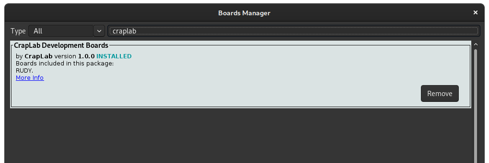

# CrapLab Arduino Boards

Arduino board support for [CrapLab](https://craplab.fi/) development boards, which at this point is limited to [RUDY](https://github.com/sgreg/rudy).

Allows you to add RUDY as 3rd party board to the Arduino IDE via its Board Manager and program it like any other Arduino device - it is after all just an ATmega328 device like the Arduino UNO. There are however two differences: RUDY is clocked at 12MHz instead of the usual 16MHz, and it's a simple, no frills development board, so there is no UART on board and therefore requires an external programmer to upload the Arduino sketch.

Note that this is generally a very hackish approach, and this is a "Arduino can be used on the device as well" rather than a "the device is specifically meant for Arduino" situation.

## Installing 

Adding a 3rd party board package is a quite straightforward process, and I would practically end up copying already existing instructions here - so instead I will just link to [the ones from Adafruit](https://learn.adafruit.com/add-boards-arduino-v164/setup).

The _Additional Boards Manager URL_ in this case is:
```
https://raw.githubusercontent.com/sgreg/craplab-arduino/master/package_craplab_index.json
```

and the board package will show up as **CrapLab Development Boards**


